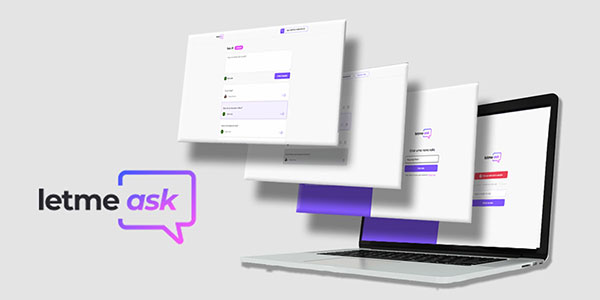
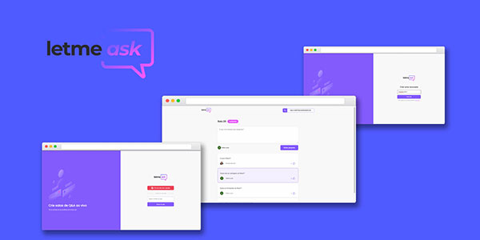

<h1 align="center">
  
</h1>

  <a href="#-tecnologias">Technologies</a>&nbsp;&nbsp;&nbsp;|&nbsp;&nbsp;&nbsp;
  <a href="#-como-executar">How to run?</a>&nbsp;&nbsp;&nbsp;|&nbsp;&nbsp;&nbsp;
  <a href="#-projeto-em-producao">Production</a>&nbsp;&nbsp;&nbsp;

  

 

  

## ✨ Technologies

This project was developed with the following technologies:

- [React](https://reactjs.org)
- [TypeScript](https://www.typescriptlang.org/)
- [Firebase](http://firebase.google.com)

## 💻 Project

Letmeask is an app where you can create and enter a question room, very useful for those who do lives, meetings and need an app to manage questions.

  

## 🚀 How to run

- Clone the repository
- Install dependencies with `yarn`
- Start the server with `yarn start`

You can now access [`localhost:3000`](http://localhost:3000) from your browser.

## 💻 Project in Execution

- [Click here!](https://letmeask-80e86.web.app)

---
